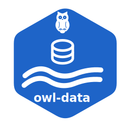

  

<h1 align="center">owl-data</h1>

  Data analysis tools for water systems

-----

Part of **[OpenWaterLab(OWL)](https://github.com/OpenWaterLab)** - free and open-source tools for water system modelling, simulation and analysis.

Created and maintained by: **[BIOMATH-UGent](https://github.com/UGentBiomath)**

**owl-data**: A Python package for analysis, validation, cleaning, gap-filling and visualization of data acquired in the context of water and wastewater systems.

