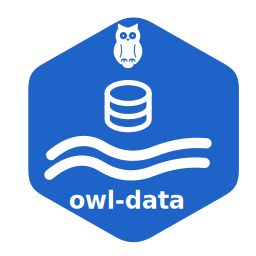

  

<h1 align="center">owl-data</h1>

  Data analysis tools for water system modelling and analysis

-----

Part of **[Open Water Lab(OWL)](https://github.com/OpenWaterLab)** - free and open-source tools for water system modelling, simulation and analysis.

Created and maintained by: **[BIOMATH-UGent](https://biomath.ugent.be)**

**owl-data**: A Python package for analysis, validation, cleaning, gap-filling and visualization of data acquired in the context of water and wastewater systems.

Code of Conduct
-----

owl-data is a community-driven free and open-source project developed by contributors to Open Water Lab (OWL). It committed to providing a welcoming, inclusive, and collaborative environment for everyone involved in the project. Please follow guidelines provided in Open Water Lab (OWL) [code of conduct](https://github.com/OpenWaterLab/owl-data?tab=coc-ov-file).

Contributing
-----

Contributions of all kinds are welcome including bug reports, feature proposals, documentation improvements, and new tools aligned with the OWL mission.

Please follow the Open Water Lab [contribution](https://github.com/OpenWaterLab/owl-data?tab=contributing-ov-file) guidelines.

License
-----

This project is released under the GNU General Public License v3.0 (GPLv3).

All derivative works must remain open and distributed under the same license.

See [LICENSE](https://github.com/OpenWaterLab/owl-data/blob/main/LICENSE) for full details.

Acknowledgement
-----

This package builds upon the earlier work of **[wwdata](https://github.com/UGentBiomath/wwdata)**, originally developed by **Chaim De Mulder** at BIOMATH, Ghent University, licensed under GPL3.0 which provided the initial foundation for data handling and validation for water systems. The current implementation extends and generalizes these concepts within a broader, modular framework.

